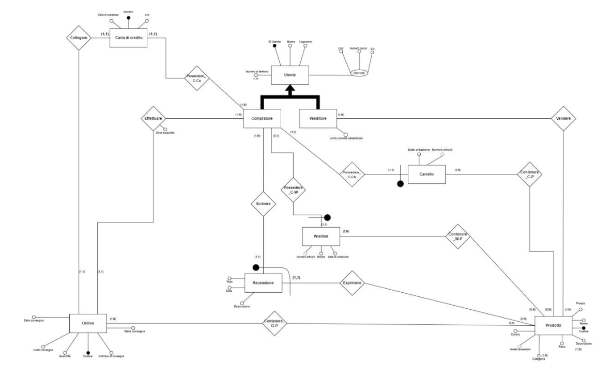

Database schema for e-commerce sites.

## Description

The diagram represents a generic base for web stores.
The diagram was created using [draw.io](https://app.diagrams.net/)

## Requirements

- **MySQL 8.0+**  
- **Workbench** (optional, for import/export) 
- Dump `.sql` included for the easy creation of the tables.  

## Diagram

 **You can click on the immage in order to open the manual (in italian)**

